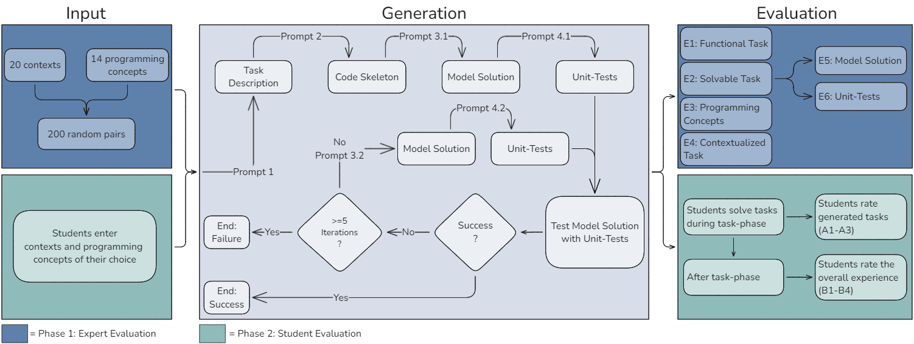

# Unlimited Practice Opportunities: Automated Generation of Comprehensive, Personalized Programming Tasks (Supplementary Data)
For our submission to iTiCSE 2025 we provide here the supplementary data. This includes both the prompts used and the tasks generated in German (original) and English (translated). 

The translation was automatically generated by an LLM (gpt-4o-2024-08-06) and proofread by the authors. We did not re-evaluate the English version of the tasks for code execution and correctness.

We also provide a citable version on OSF (doi: [10.17605/OSF.IO/5HXB4](https://doi.org/10.17605/OSF.IO/5HXB4))
# Prompts

- The workflow was implemented with <a href="https://langchain-ai.github.io/langgraphjs/" target="_blank">LangGraph.js</a>.
- To test the model solution with the unit tests, we used our own open source code execution environment [Jury 1](https://github.com/hardebusch/jury1).

| Prompt  | German (original)                                                              | English (translated)                                                          |
| ------- | ------------------------------------------------------------------------------ | ----------------------------------------------------------------------------- |
| 1       | <a href="prompts/german/prompt_1.md" target="_blank">Prompt 1 (DE)</a>         | <a href="prompts/english/prompt_1.md" target="_blank">Prompt 1 (EN)</a>       |
| 2       | <a href="prompts/german/prompt_2.md" target="_blank">Prompt 2 (DE)</a>         | <a href="prompts/english/prompt_2.md" target="_blank">Prompt 2 (EN)</a>       |
| 3.1     | <a href="prompts/german/prompt_3.1.md" target="_blank">Prompt 3.1 (DE)</a>     | <a href="prompts/english/prompt_3.1.md" target="_blank">Prompt 3.1 (EN)</a>   |
| 3.2     | <a href="prompts/german/prompt_3.2.md" target="_blank">Prompt 3.2 (DE)</a>     | <a href="prompts/english/prompt_3.2.md" target="_blank">Prompt 3.2 (EN)</a>   |
| 4.1     | <a href="prompts/german/prompt_4.1.md" target="_blank">Prompt 4.1 (DE)</a>     | <a href="prompts/english/prompt_4.1.md" target="_blank">Prompt 4.1 (EN)</a>   |
| 4.2     | <a href="prompts/german/prompt_4.2.md" target="_blank">Prompt 4.2 (DE)</a>     | <a href="prompts/english/prompt_4.2.md" target="_blank">Prompt 4.2 (EN)</a>   |

# Generated Tasks
We provide all generated tasks in JSON format:
- <a href="tasks_german.json" target="_blank">All 200 tasks in German (original)</a>
- <a href="tasks_english.json" target="_blank">All 200 tasks in English (translated)</a>

We also provide all tasks in a more human readable format in markdown syntax:
## One Programming Concept
| ID | German (original)   | English (translated)  | Programming Concept | Context |
|---|-------------|--------------|-------------------|---------|
| 1 | <a href="tasks/german/task_1.md" target="_blank">Task 1 (DE)</a> | <a href="tasks/english/task_1.md" target="_blank">Task 1 (EN)</a> | For loops | Modern Gaming |
| 2 | <a href="tasks/german/task_2.md" target="_blank">Task 2 (DE)</a> | <a href="tasks/english/task_2.md" target="_blank">Task 2 (EN)</a> | While loops | Film |
| 3 | <a href="tasks/german/task_3.md" target="_blank">Task 3 (DE)</a> | <a href="tasks/english/task_3.md" target="_blank">Task 3 (EN)</a> | For Loops | Relationships |
| 4 | <a href="tasks/german/task_4.md" target="_blank">Task 4 (DE)</a> | <a href="tasks/english/task_4.md" target="_blank">Task 4 (EN)</a> | String | Pets |
| 5 | <a href="tasks/german/task_5.md" target="_blank">Task 5 (DE)</a> | <a href="tasks/english/task_5.md" target="_blank">Task 5 (EN)</a> | Recursion | Cooking |
| 6 | <a href="tasks/german/task_6.md" target="_blank">Task 6 (DE)</a> | <a href="tasks/english/task_6.md" target="_blank">Task 6 (EN)</a> | If-Else statements | Animals |
| 7 | <a href="tasks/german/task_7.md" target="_blank">Task 7 (DE)</a> | <a href="tasks/english/task_7.md" target="_blank">Task 7 (EN)</a> | If-Else statements | Basketball |
| 8 | <a href="tasks/german/task_8.md" target="_blank">Task 8 (DE)</a> | <a href="tasks/english/task_8.md" target="_blank">Task 8 (EN)</a> | If-Else statements | Music |
| 9 | <a href="tasks/german/task_9.md" target="_blank">Task 9 (DE)</a> | <a href="tasks/english/task_9.md" target="_blank">Task 9 (EN)</a> | Higher-order functions | Streaming Services |
| 10 | <a href="tasks/german/task_10.md" target="_blank">Task 10 (DE)</a> | <a href="tasks/english/task_10.md" target="_blank">Task 10 (EN)</a> | Functions as Variables | Virtual Reality |
| 11 | <a href="tasks/german/task_11.md" target="_blank">Task 11 (DE)</a> | <a href="tasks/english/task_11.md" target="_blank">Task 11 (EN)</a> | Recursion | Aquarium |
| 12 | <a href="tasks/german/task_12.md" target="_blank">Task 12 (DE)</a> | <a href="tasks/english/task_12.md" target="_blank">Task 12 (EN)</a> | While loops | Sports |
| 13 | <a href="tasks/german/task_13.md" target="_blank">Task 13 (DE)</a> | <a href="tasks/english/task_13.md" target="_blank">Task 13 (EN)</a> | Higher-order functions | Rugby |
| 14 | <a href="tasks/german/task_14.md" target="_blank">Task 14 (DE)</a> | <a href="tasks/english/task_14.md" target="_blank">Task 14 (EN)</a> | Higher-order functions | Mental Health |
| 15 | <a href="tasks/german/task_15.md" target="_blank">Task 15 (DE)</a> | <a href="tasks/english/task_15.md" target="_blank">Task 15 (EN)</a> | Lists | Pets |
| 16 | <a href="tasks/german/task_16.md" target="_blank">Task 16 (DE)</a> | <a href="tasks/english/task_16.md" target="_blank">Task 16 (EN)</a> | If-Else statements | Animals |
| 17 | <a href="tasks/german/task_17.md" target="_blank">Task 17 (DE)</a> | <a href="tasks/english/task_17.md" target="_blank">Task 17 (EN)</a> | Float | Modern Gaming |
| 18 | <a href="tasks/german/task_18.md" target="_blank">Task 18 (DE)</a> | <a href="tasks/english/task_18.md" target="_blank">Task 18 (EN)</a> | Integer | Aquarium |
| 19 | <a href="tasks/german/task_19.md" target="_blank">Task 19 (DE)</a> | <a href="tasks/english/task_19.md" target="_blank">Task 19 (EN)</a> | For loops | Amusement Park |
| 20 | <a href="tasks/german/task_20.md" target="_blank">Task 20 (DE)</a> | <a href="tasks/english/task_20.md" target="_blank">Task 20 (EN)</a> | Tuples | Film |
| 21 | <a href="tasks/german/task_21.md" target="_blank">Task 21 (DE)</a> | <a href="tasks/english/task_21.md" target="_blank">Task 21 (EN)</a> | Higher-order functions | Rugby |
| 22 | <a href="tasks/german/task_22.md" target="_blank">Task 22 (DE)</a> | <a href="tasks/english/task_22.md" target="_blank">Task 22 (EN)</a> | Recursion | Virtual Reality |
| 23 | <a href="tasks/german/task_23.md" target="_blank">Task 23 (DE)</a> | <a href="tasks/english/task_23.md" target="_blank">Task 23 (EN)</a> | Higher-order functions | Rugby |
| 24 | <a href="tasks/german/task_24.md" target="_blank">Task 24 (DE)</a> | <a href="tasks/english/task_24.md" target="_blank">Task 24 (EN)</a> | Tuples | Fishing |
| 25 | <a href="tasks/german/task_25.md" target="_blank">Task 25 (DE)</a> | <a href="tasks/english/task_25.md" target="_blank">Task 25 (EN)</a> | While loops | Gardening |
| 26 | <a href="tasks/german/task_26.md" target="_blank">Task 26 (DE)</a> | <a href="tasks/english/task_26.md" target="_blank">Task 26 (EN)</a> | If-Else statements | Modern Gaming |
| 27 | <a href="tasks/german/task_27.md" target="_blank">Task 27 (DE)</a> | <a href="tasks/english/task_27.md" target="_blank">Task 27 (EN)</a> | Logical operators (==, !=, <, >, <=, >=, or, and, not) | Fishing |
| 28 | <a href="tasks/german/task_28.md" target="_blank">Task 28 (DE)</a> | <a href="tasks/english/task_28.md" target="_blank">Task 28 (EN)</a> | While loops | Social Media |
| 29 | <a href="tasks/german/task_29.md" target="_blank">Task 29 (DE)</a> | <a href="tasks/english/task_29.md" target="_blank">Task 29 (EN)</a> | Recursion | Fishing |
| 30 | <a href="tasks/german/task_30.md" target="_blank">Task 30 (DE)</a> | <a href="tasks/english/task_30.md" target="_blank">Task 30 (EN)</a> | Lists | Cooking |
| 31 | <a href="tasks/german/task_31.md" target="_blank">Task 31 (DE)</a> | <a href="tasks/english/task_31.md" target="_blank">Task 31 (EN)</a> | Lists | Cooking |
| 32 | <a href="tasks/german/task_32.md" target="_blank">Task 32 (DE)</a> | <a href="tasks/english/task_32.md" target="_blank">Task 32 (EN)</a> | Tuples | Amusement Park |
| 33 | <a href="tasks/german/task_33.md" target="_blank">Task 33 (DE)</a> | <a href="tasks/english/task_33.md" target="_blank">Task 33 (EN)</a> | Tuples | Restaurant |
| 34 | <a href="tasks/german/task_34.md" target="_blank">Task 34 (DE)</a> | <a href="tasks/english/task_34.md" target="_blank">Task 34 (EN)</a> | String | Sports |
| 35 | <a href="tasks/german/task_35.md" target="_blank">Task 35 (DE)</a> | <a href="tasks/english/task_35.md" target="_blank">Task 35 (EN)</a> | If-Else statements; Logical operators (==, !=, <, >, <=, >=, or, and, not) | Olympics |
| 36 | <a href="tasks/german/task_36.md" target="_blank">Task 36 (DE)</a> | <a href="tasks/english/task_36.md" target="_blank">Task 36 (EN)</a> | Functions as variables | Cooking |
| 37 | <a href="tasks/german/task_37.md" target="_blank">Task 37 (DE)</a> | <a href="tasks/english/task_37.md" target="_blank">Task 37 (EN)</a> | Operations with numbers | Restaurant |
| 38 | <a href="tasks/german/task_38.md" target="_blank">Task 38 (DE)</a> | <a href="tasks/english/task_38.md" target="_blank">Task 38 (EN)</a> | Logical operators (==, !=, <, >, <=, >=, or, and, not) | Cooking |
| 39 | <a href="tasks/german/task_39.md" target="_blank">Task 39 (DE)</a> | <a href="tasks/english/task_39.md" target="_blank">Task 39 (EN)</a> | If-Else statements | Olympics |
| 40 | <a href="tasks/german/task_40.md" target="_blank">Task 40 (DE)</a> | <a href="tasks/english/task_40.md" target="_blank">Task 40 (EN)</a> | If-Else statements | Social Media |
| 41 | <a href="tasks/german/task_41.md" target="_blank">Task 41 (DE)</a> | <a href="tasks/english/task_41.md" target="_blank">Task 41 (EN)</a> | Recursion | Olympics |
| 42 | <a href="tasks/german/task_42.md" target="_blank">Task 42 (DE)</a> | <a href="tasks/english/task_42.md" target="_blank">Task 42 (EN)</a> | Lists | Modern Gaming |
| 43 | <a href="tasks/german/task_43.md" target="_blank">Task 43 (DE)</a> | <a href="tasks/english/task_43.md" target="_blank">Task 43 (EN)</a> | Float | Virtual Reality |
| 44 | <a href="tasks/german/task_44.md" target="_blank">Task 44 (DE)</a> | <a href="tasks/english/task_44.md" target="_blank">Task 44 (EN)</a> | String | Relationships |
| 45 | <a href="tasks/german/task_45.md" target="_blank">Task 45 (DE)</a> | <a href="tasks/english/task_45.md" target="_blank">Task 45 (EN)</a> | Higher-order functions | Cooking |
| 46 | <a href="tasks/german/task_46.md" target="_blank">Task 46 (DE)</a> | <a href="tasks/english/task_46.md" target="_blank">Task 46 (EN)</a> | Integer | Film |
| 47 | <a href="tasks/german/task_47.md" target="_blank">Task 47 (DE)</a> | <a href="tasks/english/task_47.md" target="_blank">Task 47 (EN)</a> | String | Fishing |
| 48 | <a href="tasks/german/task_48.md" target="_blank">Task 48 (DE)</a> | <a href="tasks/english/task_48.md" target="_blank">Task 48 (EN)</a> | String | Cooking |
| 49 | <a href="tasks/german/task_49.md" target="_blank">Task 49 (DE)</a> | <a href="tasks/english/task_49.md" target="_blank">Task 49 (EN)</a> | Operations with numbers | Restaurant |
| 50 | <a href="tasks/german/task_50.md" target="_blank">Task 50 (DE)</a> | <a href="tasks/english/task_50.md" target="_blank">Task 50 (EN)</a> | Float | Animals |
| 51 | <a href="tasks/german/task_51.md" target="_blank">Task 51 (DE)</a> | <a href="tasks/english/task_51.md" target="_blank">Task 51 (EN)</a> | String | Modern Gaming |
| 52 | <a href="tasks/german/task_52.md" target="_blank">Task 52 (DE)</a> | <a href="tasks/english/task_52.md" target="_blank">Task 52 (EN)</a> | Operations with numbers | Basketball |
| 53 | <a href="tasks/german/task_53.md" target="_blank">Task 53 (DE)</a> | <a href="tasks/english/task_53.md" target="_blank">Task 53 (EN)</a> | While loops | Basketball |
| 54 | <a href="tasks/german/task_54.md" target="_blank">Task 54 (DE)</a> | <a href="tasks/english/task_54.md" target="_blank">Task 54 (EN)</a> | For loops | Modern Gaming |
| 55 | <a href="tasks/german/task_55.md" target="_blank">Task 55 (DE)</a> | <a href="tasks/english/task_55.md" target="_blank">Task 55 (EN)</a> | Functions as variables | Sports |
| 56 | <a href="tasks/german/task_56.md" target="_blank">Task 56 (DE)</a> | <a href="tasks/english/task_56.md" target="_blank">Task 56 (EN)</a> | Higher-order functions | Mental Health |
| 57 | <a href="tasks/german/task_57.md" target="_blank">Task 57 (DE)</a> | <a href="tasks/english/task_57.md" target="_blank">Task 57 (EN)</a> | Tuple | Mental Health |
| 58 | <a href="tasks/german/task_58.md" target="_blank">Task 58 (DE)</a> | <a href="tasks/english/task_58.md" target="_blank">Task 58 (EN)</a> | Integer | Social Media |
| 59 | <a href="tasks/german/task_59.md" target="_blank">Task 59 (DE)</a> | <a href="tasks/english/task_59.md" target="_blank">Task 59 (EN)</a> | Recursion | Cooking |
| 60 | <a href="tasks/german/task_60.md" target="_blank">Task 60 (DE)</a> | <a href="tasks/english/task_60.md" target="_blank">Task 60 (EN)</a> | Integer | Cooking |
| 61 | <a href="tasks/german/task_61.md" target="_blank">Task 61 (DE)</a> | <a href="tasks/english/task_61.md" target="_blank">Task 61 (EN)</a> | Tuples | Gardening |
| 62 | <a href="tasks/german/task_62.md" target="_blank">Task 62 (DE)</a> | <a href="tasks/english/task_62.md" target="_blank">Task 62 (EN)</a> | Lists | Fishing |
| 63 | <a href="tasks/german/task_63.md" target="_blank">Task 63 (DE)</a> | <a href="tasks/english/task_63.md" target="_blank">Task 63 (EN)</a> | String | Social Media |
| 64 | <a href="tasks/german/task_64.md" target="_blank">Task 64 (DE)</a> | <a href="tasks/english/task_64.md" target="_blank">Task 64 (EN)</a> | Tuples | Basketball |
| 65 | <a href="tasks/german/task_65.md" target="_blank">Task 65 (DE)</a> | <a href="tasks/english/task_65.md" target="_blank">Task 65 (EN)</a> | Recursion | Rugby |
| 66 | <a href="tasks/german/task_66.md" target="_blank">Task 66 (DE)</a> | <a href="tasks/english/task_66.md" target="_blank">Task 66 (EN)</a> | Functions as variables | Mental Health |
| 67 | <a href="tasks/german/task_67.md" target="_blank">Task 67 (DE)</a> | <a href="tasks/english/task_67.md" target="_blank">Task 67 (EN)</a> | Boolean and None | Sports |
| 68 | <a href="tasks/german/task_68.md" target="_blank">Task 68 (DE)</a> | <a href="tasks/english/task_68.md" target="_blank">Task 68 (EN)</a> | Recursion | Music |
| 69 | <a href="tasks/german/task_69.md" target="_blank">Task 69 (DE)</a> | <a href="tasks/english/task_69.md" target="_blank">Task 69 (EN)</a> | Float | Music |
| 70 | <a href="tasks/german/task_70.md" target="_blank">Task 70 (DE)</a> | <a href="tasks/english/task_70.md" target="_blank">Task 70 (EN)</a> | Logical operators (==, !=, <, >, <=, >=, or, and, not) | Fishing |
| 71 | <a href="tasks/german/task_71.md" target="_blank">Task 71 (DE)</a> | <a href="tasks/english/task_71.md" target="_blank">Task 71 (EN)</a> | Integer | Streaming Services |
| 72 | <a href="tasks/german/task_72.md" target="_blank">Task 72 (DE)</a> | <a href="tasks/english/task_72.md" target="_blank">Task 72 (EN)</a> | Integer | Modern Gaming |
| 73 | <a href="tasks/german/task_73.md" target="_blank">Task 73 (DE)</a> | <a href="tasks/english/task_73.md" target="_blank">Task 73 (EN)</a> | Recursion | Virtual Reality |
| 74 | <a href="tasks/german/task_74.md" target="_blank">Task 74 (DE)</a> | <a href="tasks/english/task_74.md" target="_blank">Task 74 (EN)</a> | Higher-order functions | Rugby |
| 75 | <a href="tasks/german/task_75.md" target="_blank">Task 75 (DE)</a> | <a href="tasks/english/task_75.md" target="_blank">Task 75 (EN)</a> | Integer | Pets |
| 76 | <a href="tasks/german/task_76.md" target="_blank">Task 76 (DE)</a> | <a href="tasks/english/task_76.md" target="_blank">Task 76 (EN)</a> | For loops | Basketball |
| 77 | <a href="tasks/german/task_77.md" target="_blank">Task 77 (DE)</a> | <a href="tasks/english/task_77.md" target="_blank">Task 77 (EN)</a> | Boolean and None | Aquarium |
| 78 | <a href="tasks/german/task_78.md" target="_blank">Task 78 (DE)</a> | <a href="tasks/english/task_78.md" target="_blank">Task 78 (EN)</a> | Functions as variables | Pets |
| 79 | <a href="tasks/german/task_79.md" target="_blank">Task 79 (DE)</a> | <a href="tasks/english/task_79.md" target="_blank">Task 79 (EN)</a> | Higher-order functions | Mental Health |
| 80 | <a href="tasks/german/task_80.md" target="_blank">Task 80 (DE)</a> | <a href="tasks/english/task_80.md" target="_blank">Task 80 (EN)</a> | Recursion | Pets |
| 81 | <a href="tasks/german/task_81.md" target="_blank">Task 81 (DE)</a> | <a href="tasks/english/task_81.md" target="_blank">Task 81 (EN)</a> | Tuples | Gardening |
| 82 | <a href="tasks/german/task_82.md" target="_blank">Task 82 (DE)</a> | <a href="tasks/english/task_82.md" target="_blank">Task 82 (EN)</a> | Integer | Animals |
| 83 | <a href="tasks/german/task_83.md" target="_blank">Task 83 (DE)</a> | <a href="tasks/english/task_83.md" target="_blank">Task 83 (EN)</a> | Float | Mental Health |
| 84 | <a href="tasks/german/task_84.md" target="_blank">Task 84 (DE)</a> | <a href="tasks/english/task_84.md" target="_blank">Task 84 (EN)</a> | Lists | Fishing |
| 85 | <a href="tasks/german/task_85.md" target="_blank">Task 85 (DE)</a> | <a href="tasks/english/task_85.md" target="_blank">Task 85 (EN)</a> | Integer | Aquarium |
| 86 | <a href="tasks/german/task_86.md" target="_blank">Task 86 (DE)</a> | <a href="tasks/english/task_86.md" target="_blank">Task 86 (EN)</a> | While loops | Fishing |
| 87 | <a href="tasks/german/task_87.md" target="_blank">Task 87 (DE)</a> | <a href="tasks/english/task_87.md" target="_blank">Task 87 (EN)</a> | Recursion | Fishing |
| 88 | <a href="tasks/german/task_88.md" target="_blank">Task 88 (DE)</a> | <a href="tasks/english/task_88.md" target="_blank">Task 88 (EN)</a> | Integer | Sports |
| 89 | <a href="tasks/german/task_89.md" target="_blank">Task 89 (DE)</a> | <a href="tasks/english/task_89.md" target="_blank">Task 89 (EN)</a> | For loops | Restaurant |
| 90 | <a href="tasks/german/task_90.md" target="_blank">Task 90 (DE)</a> | <a href="tasks/english/task_90.md" target="_blank">Task 90 (EN)</a> | For loops | Fishing |
| 91 | <a href="tasks/german/task_91.md" target="_blank">Task 91 (DE)</a> | <a href="tasks/english/task_91.md" target="_blank">Task 91 (EN)</a> | While loops | Aquarium |
| 92 | <a href="tasks/german/task_92.md" target="_blank">Task 92 (DE)</a> | <a href="tasks/english/task_92.md" target="_blank">Task 92 (EN)</a> | Operations with numbers | Aquarium |
| 93 | <a href="tasks/german/task_93.md" target="_blank">Task 93 (DE)</a> | <a href="tasks/english/task_93.md" target="_blank">Task 93 (EN)</a> | Lists | Cooking |
| 94 | <a href="tasks/german/task_94.md" target="_blank">Task 94 (DE)</a> | <a href="tasks/english/task_94.md" target="_blank">Task 94 (EN)</a> | Float | Rugby |
| 95 | <a href="tasks/german/task_95.md" target="_blank">Task 95 (DE)</a> | <a href="tasks/english/task_95.md" target="_blank">Task 95 (EN)</a> | Higher-order functions | Gardening |
| 96 | <a href="tasks/german/task_96.md" target="_blank">Task 96 (DE)</a> | <a href="tasks/english/task_96.md" target="_blank">Task 96 (EN)</a> | Higher-order functions | Sports |
| 97 | <a href="tasks/german/task_97.md" target="_blank">Task 97 (DE)</a> | <a href="tasks/english/task_97.md" target="_blank">Task 97 (EN)</a> | Boolean and None | Pets |
| 98 | <a href="tasks/german/task_98.md" target="_blank">Task 98 (DE)</a> | <a href="tasks/english/task_98.md" target="_blank">Task 98 (EN)</a> | Float | Cooking |
| 99 | <a href="tasks/german/task_99.md" target="_blank">Task 99 (DE)</a> | <a href="tasks/english/task_99.md" target="_blank">Task 99 (EN)</a> | If-Else statements | Animals |
| 100 | <a href="tasks/german/task_100.md" target="_blank">Task 100 (DE)</a> | <a href="tasks/english/task_100.md" target="_blank">Task 100 (EN)</a> | Recursion | Animals |

## Two Programming Concepts
| ID | German (original)   | English (translated)  | Programming Concept | Context |
|---|-------------|--------------|-------------------|---------|
| 101 | <a href="tasks/german/task_101.md" target="_blank">Task 101 (DE)</a> | <a href="tasks/english/task_101.md" target="_blank">Task 101 (EN)</a> | Recursion;If-Else statements | Fishing |
| 102 | <a href="tasks/german/task_102.md" target="_blank">Task 102 (DE)</a> | <a href="tasks/english/task_102.md" target="_blank">Task 102 (EN)</a> | Operations with numbers; For loops | Sports |
| 103 | <a href="tasks/german/task_103.md" target="_blank">Task 103 (DE)</a> | <a href="tasks/english/task_103.md" target="_blank">Task 103 (EN)</a> | Boolean and None; Float | Animals |
| 104 | <a href="tasks/german/task_104.md" target="_blank">Task 104 (DE)</a> | <a href="tasks/english/task_104.md" target="_blank">Task 104 (EN)</a> | Functions as variables; Integer | Animals |
| 105 | <a href="tasks/german/task_105.md" target="_blank">Task 105 (DE)</a> | <a href="tasks/english/task_105.md" target="_blank">Task 105 (EN)</a> | Logical operators (==, !=, <, >, <=, >=, or, and, not);While loops | Modern Gaming |
| 106 | <a href="tasks/german/task_106.md" target="_blank">Task 106 (DE)</a> | <a href="tasks/english/task_106.md" target="_blank">Task 106 (EN)</a> | Float;Tuple | Pets |
| 107 | <a href="tasks/german/task_107.md" target="_blank">Task 107 (DE)</a> | <a href="tasks/english/task_107.md" target="_blank">Task 107 (EN)</a> | If-Else statements; Logical operators (==, !=, <, >, <=, >=, or, and, not) | Basketball |
| 108 | <a href="tasks/german/task_108.md" target="_blank">Task 108 (DE)</a> | <a href="tasks/english/task_108.md" target="_blank">Task 108 (EN)</a> | Lists; Recursion | Amusement Park |
| 109 | <a href="tasks/german/task_109.md" target="_blank">Task 109 (DE)</a> | <a href="tasks/english/task_109.md" target="_blank">Task 109 (EN)</a> | Functions as variables; Operations with numbers | Fishing |
| 110 | <a href="tasks/german/task_110.md" target="_blank">Task 110 (DE)</a> | <a href="tasks/english/task_110.md" target="_blank">Task 110 (EN)</a> | Boolean and None; Logical operators (==, !=, <, >, <=, >=, or, and, not) | Social Media |
| 111 | <a href="tasks/german/task_111.md" target="_blank">Task 111 (DE)</a> | <a href="tasks/english/task_111.md" target="_blank">Task 111 (EN)</a> | Boolean and None; Float | Sports |
| 112 | <a href="tasks/german/task_112.md" target="_blank">Task 112 (DE)</a> | <a href="tasks/english/task_112.md" target="_blank">Task 112 (EN)</a> | Tuples; Functions as variables | Mental Health |
| 113 | <a href="tasks/german/task_113.md" target="_blank">Task 113 (DE)</a> | <a href="tasks/english/task_113.md" target="_blank">Task 113 (EN)</a> | Float;While loops | Amusement Park |
| 114 | <a href="tasks/german/task_114.md" target="_blank">Task 114 (DE)</a> | <a href="tasks/english/task_114.md" target="_blank">Task 114 (EN)</a> | While loops; Higher-order functions | Cooking |
| 115 | <a href="tasks/german/task_115.md" target="_blank">Task 115 (DE)</a> | <a href="tasks/english/task_115.md" target="_blank">Task 115 (EN)</a> | Operations with numbers;Integer | Modern Gaming |
| 116 | <a href="tasks/german/task_116.md" target="_blank">Task 116 (DE)</a> | <a href="tasks/english/task_116.md" target="_blank">Task 116 (EN)</a> | If-Else statements;Operations with numbers | Modern Gaming |
| 117 | <a href="tasks/german/task_117.md" target="_blank">Task 117 (DE)</a> | <a href="tasks/english/task_117.md" target="_blank">Task 117 (EN)</a> | Boolean and None; Higher-order functions | Social Media |
| 118 | <a href="tasks/german/task_118.md" target="_blank">Task 118 (DE)</a> | <a href="tasks/english/task_118.md" target="_blank">Task 118 (EN)</a> | Lists;Float | Olympics |
| 119 | <a href="tasks/german/task_119.md" target="_blank">Task 119 (DE)</a> | <a href="tasks/english/task_119.md" target="_blank">Task 119 (EN)</a> | While loops;Boolean and None | Streaming Services |
| 120 | <a href="tasks/german/task_120.md" target="_blank">Task 120 (DE)</a> | <a href="tasks/english/task_120.md" target="_blank">Task 120 (EN)</a> | String; Lists | Film |
| 121 | <a href="tasks/german/task_121.md" target="_blank">Task 121 (DE)</a> | <a href="tasks/english/task_121.md" target="_blank">Task 121 (EN)</a> | Lists;If-Else statements | Rugby |
| 122 | <a href="tasks/german/task_122.md" target="_blank">Task 122 (DE)</a> | <a href="tasks/english/task_122.md" target="_blank">Task 122 (EN)</a> | For loops; While loops | Amusement Park |
| 123 | <a href="tasks/german/task_123.md" target="_blank">Task 123 (DE)</a> | <a href="tasks/english/task_123.md" target="_blank">Task 123 (EN)</a> | While loops;If-Else statements | Music |
| 124 | <a href="tasks/german/task_124.md" target="_blank">Task 124 (DE)</a> | <a href="tasks/english/task_124.md" target="_blank">Task 124 (EN)</a> | Functions as variables; Logical operators (==, !=, <, >, <=, >=, or, and, not) | Aquarium |
| 125 | <a href="tasks/german/task_125.md" target="_blank">Task 125 (DE)</a> | <a href="tasks/english/task_125.md" target="_blank">Task 125 (EN)</a> | If-Else statements; For loops | Cooking |
| 126 | <a href="tasks/german/task_126.md" target="_blank">Task 126 (DE)</a> | <a href="tasks/english/task_126.md" target="_blank">Task 126 (EN)</a> | Float; Lists | Animals |
| 127 | <a href="tasks/german/task_127.md" target="_blank">Task 127 (DE)</a> | <a href="tasks/english/task_127.md" target="_blank">Task 127 (EN)</a> | Tuples;Integer | Restaurant |
| 128 | <a href="tasks/german/task_128.md" target="_blank">Task 128 (DE)</a> | <a href="tasks/english/task_128.md" target="_blank">Task 128 (EN)</a> | Boolean and None; For loops | Fishing |
| 129 | <a href="tasks/german/task_129.md" target="_blank">Task 129 (DE)</a> | <a href="tasks/english/task_129.md" target="_blank">Task 129 (EN)</a> | Boolean and None;For loops | Animals |
| 130 | <a href="tasks/german/task_130.md" target="_blank">Task 130 (DE)</a> | <a href="tasks/english/task_130.md" target="_blank">Task 130 (EN)</a> | If-Else statements; String | Amusement Park |
| 131 | <a href="tasks/german/task_131.md" target="_blank">Task 131 (DE)</a> | <a href="tasks/english/task_131.md" target="_blank">Task 131 (EN)</a> | For loops; If-Else statements | Restaurant |
| 132 | <a href="tasks/german/task_132.md" target="_blank">Task 132 (DE)</a> | <a href="tasks/english/task_132.md" target="_blank">Task 132 (EN)</a> | Recursion; Functions as variables | Basketball |
| 133 | <a href="tasks/german/task_133.md" target="_blank">Task 133 (DE)</a> | <a href="tasks/english/task_133.md" target="_blank">Task 133 (EN)</a> | Recursion;For loops | Basketball |
| 134 | <a href="tasks/german/task_134.md" target="_blank">Task 134 (DE)</a> | <a href="tasks/english/task_134.md" target="_blank">Task 134 (EN)</a> | Functions as variables; Boolean and None | Pets |
| 135 | <a href="tasks/german/task_135.md" target="_blank">Task 135 (DE)</a> | <a href="tasks/english/task_135.md" target="_blank">Task 135 (EN)</a> | Lists;String | Streaming Services |
| 136 | <a href="tasks/german/task_136.md" target="_blank">Task 136 (DE)</a> | <a href="tasks/english/task_136.md" target="_blank">Task 136 (EN)</a> | String; Integer | Relationships |
| 137 | <a href="tasks/german/task_137.md" target="_blank">Task 137 (DE)</a> | <a href="tasks/english/task_137.md" target="_blank">Task 137 (EN)</a> | While loops; Boolean and None | Basketball |
| 138 | <a href="tasks/german/task_138.md" target="_blank">Task 138 (DE)</a> | <a href="tasks/english/task_138.md" target="_blank">Task 138 (EN)</a> | Boolean and None; String | Relationships |
| 139 | <a href="tasks/german/task_139.md" target="_blank">Task 139 (DE)</a> | <a href="tasks/english/task_139.md" target="_blank">Task 139 (EN)</a> | Logical operators (==, !=, <, >, <=, >=, or, and, not); While loops | Relationships |
| 140 | <a href="tasks/german/task_140.md" target="_blank">Task 140 (DE)</a> | <a href="tasks/english/task_140.md" target="_blank">Task 140 (EN)</a> | Higher-order functions; String | Virtual Reality |
| 141 | <a href="tasks/german/task_141.md" target="_blank">Task 141 (DE)</a> | <a href="tasks/english/task_141.md" target="_blank">Task 141 (EN)</a> | String; Logical operators (==, !=, <, >, <=, >=, or, and, not) | Basketball |
| 142 | <a href="tasks/german/task_142.md" target="_blank">Task 142 (DE)</a> | <a href="tasks/english/task_142.md" target="_blank">Task 142 (EN)</a> | While loops; If-Else statements | Film |
| 143 | <a href="tasks/german/task_143.md" target="_blank">Task 143 (DE)</a> | <a href="tasks/english/task_143.md" target="_blank">Task 143 (EN)</a> | Lists; Recursion | Social Media |
| 144 | <a href="tasks/german/task_144.md" target="_blank">Task 144 (DE)</a> | <a href="tasks/english/task_144.md" target="_blank">Task 144 (EN)</a> | Float; While loops | Music |
| 145 | <a href="tasks/german/task_145.md" target="_blank">Task 145 (DE)</a> | <a href="tasks/english/task_145.md" target="_blank">Task 145 (EN)</a> | Functions as variables; If-Else statements | Relationships |
| 146 | <a href="tasks/german/task_146.md" target="_blank">Task 146 (DE)</a> | <a href="tasks/english/task_146.md" target="_blank">Task 146 (EN)</a> | Lists;Tuples | Gardening |
| 147 | <a href="tasks/german/task_147.md" target="_blank">Task 147 (DE)</a> | <a href="tasks/english/task_147.md" target="_blank">Task 147 (EN)</a> | Tuples;For loops | Animals |
| 148 | <a href="tasks/german/task_148.md" target="_blank">Task 148 (DE)</a> | <a href="tasks/english/task_148.md" target="_blank">Task 148 (EN)</a> | String;Integer | Mental Health |
| 149 | <a href="tasks/german/task_149.md" target="_blank">Task 149 (DE)</a> | <a href="tasks/english/task_149.md" target="_blank">Task 149 (EN)</a> | String;Operations with numbers | Olympics |
| 150 | <a href="tasks/german/task_150.md" target="_blank">Task 150 (DE)</a> | <a href="tasks/english/task_150.md" target="_blank">Task 150 (EN)</a> | Boolean and None;Recursion | Film |

## Three Programming Concepts
| ID | German (original)   | English (translated)  | Programming Concept | Context |
|---|-------------|--------------|-------------------|---------|
| 151 | <a href="tasks/german/task_151.md" target="_blank">Task 151 (DE)</a> | <a href="tasks/english/task_151.md" target="_blank">Task 151 (EN)</a> | String; Integer; Logical operators (==, !=, <, >, <=, >=, or, and, not) | Fishing |
| 152 | <a href="tasks/german/task_152.md" target="_blank">Task 152 (DE)</a> | <a href="tasks/english/task_152.md" target="_blank">Task 152 (EN)</a> | Operations with numbers; String; Float | Olympics |
| 153 | <a href="tasks/german/task_153.md" target="_blank">Task 153 (DE)</a> | <a href="tasks/english/task_153.md" target="_blank">Task 153 (EN)</a> | For loops;If-Else statements;Operations with numbers | Pets |
| 154 | <a href="tasks/german/task_154.md" target="_blank">Task 154 (DE)</a> | <a href="tasks/english/task_154.md" target="_blank">Task 154 (EN)</a> | If-Else statements; Functions as variables; Boolean and None | Sports |
| 155 | <a href="tasks/german/task_155.md" target="_blank">Task 155 (DE)</a> | <a href="tasks/english/task_155.md" target="_blank">Task 155 (EN)</a> | Boolean and None;Operations with numbers;If-Else statements | Relationships |
| 156 | <a href="tasks/german/task_156.md" target="_blank">Task 156 (DE)</a> | <a href="tasks/english/task_156.md" target="_blank">Task 156 (EN)</a> | If-Else statements; Higher-order functions; String | Rugby |
| 157 | <a href="tasks/german/task_157.md" target="_blank">Task 157 (DE)</a> | <a href="tasks/english/task_157.md" target="_blank">Task 157 (EN)</a> | Functions as variables; Logical operators (==, !=, <, >, <=, >=, or, and, not); Lists | Virtual Reality |
| 158 | <a href="tasks/german/task_158.md" target="_blank">Task 158 (DE)</a> | <a href="tasks/english/task_158.md" target="_blank">Task 158 (EN)</a> | Operations with numbers;String;Boolean and None | Olympics |
| 159 | <a href="tasks/german/task_159.md" target="_blank">Task 159 (DE)</a> | <a href="tasks/english/task_159.md" target="_blank">Task 159 (EN)</a> | If-Else statements; Float; While loops | Social Media |
| 160 | <a href="tasks/german/task_160.md" target="_blank">Task 160 (DE)</a> | <a href="tasks/english/task_160.md" target="_blank">Task 160 (EN)</a> | While loops; Recursion; Operations with numbers | Olympics |
| 161 | <a href="tasks/german/task_161.md" target="_blank">Task 161 (DE)</a> | <a href="tasks/english/task_161.md" target="_blank">Task 161 (EN)</a> | Functions as variables;Integer;Recursion | Mental Health |
| 162 | <a href="tasks/german/task_162.md" target="_blank">Task 162 (DE)</a> | <a href="tasks/english/task_162.md" target="_blank">Task 162 (EN)</a> | Higher-order functions; Control structures (==, !=, <, >, <=, >=, or, and, not); Operations with numbers | Sports |
| 163 | <a href="tasks/german/task_163.md" target="_blank">Task 163 (DE)</a> | <a href="tasks/english/task_163.md" target="_blank">Task 163 (EN)</a> | Integer; String; Boolean and None | Pets |
| 164 | <a href="tasks/german/task_164.md" target="_blank">Task 164 (DE)</a> | <a href="tasks/english/task_164.md" target="_blank">Task 164 (EN)</a> | Tuples; Float; Higher-order functions | Gardening |
| 165 | <a href="tasks/german/task_165.md" target="_blank">Task 165 (DE)</a> | <a href="tasks/english/task_165.md" target="_blank">Task 165 (EN)</a> | Boolean and None; Logical operators (==, !=, <, >, <=, >=, or, and, not); Float | Relationships |
| 166 | <a href="tasks/german/task_166.md" target="_blank">Task 166 (DE)</a> | <a href="tasks/english/task_166.md" target="_blank">Task 166 (EN)</a> | Integer;For loops;Higher-order functions | Streaming Services |
| 167 | <a href="tasks/german/task_167.md" target="_blank">Task 167 (DE)</a> | <a href="tasks/english/task_167.md" target="_blank">Task 167 (EN)</a> | Functions as variables;Recursion;Tuples | Cooking |
| 168 | <a href="tasks/german/task_168.md" target="_blank">Task 168 (DE)</a> | <a href="tasks/english/task_168.md" target="_blank">Task 168 (EN)</a> | Logical operators (==, !=, <, >, <=, >=, or, and, not); Recursion; For loops | Streaming Services |
| 169 | <a href="tasks/german/task_169.md" target="_blank">Task 169 (DE)</a> | <a href="tasks/english/task_169.md" target="_blank">Task 169 (EN)</a> | Integer;For loops;Higher-order functions | Music |
| 170 | <a href="tasks/german/task_170.md" target="_blank">Task 170 (DE)</a> | <a href="tasks/english/task_170.md" target="_blank">Task 170 (EN)</a> | Lists;While loops;Functions as variables | Streaming Services |
| 171 | <a href="tasks/german/task_171.md" target="_blank">Task 171 (DE)</a> | <a href="tasks/english/task_171.md" target="_blank">Task 171 (EN)</a> | If-Else statements;For loops;Tuples | Basketball |
| 172 | <a href="tasks/german/task_172.md" target="_blank">Task 172 (DE)</a> | <a href="tasks/english/task_172.md" target="_blank">Task 172 (EN)</a> | Float;Higher-order functions;Integer | Animals |
| 173 | <a href="tasks/german/task_173.md" target="_blank">Task 173 (DE)</a> | <a href="tasks/english/task_173.md" target="_blank">Task 173 (EN)</a> | Operations with numbers; Tuples; For loops | Sports |
| 174 | <a href="tasks/german/task_174.md" target="_blank">Task 174 (DE)</a> | <a href="tasks/english/task_174.md" target="_blank">Task 174 (EN)</a> | Functions as variables; Float; For loops | Mental Health |
| 175 | <a href="tasks/german/task_175.md" target="_blank">Task 175 (DE)</a> | <a href="tasks/english/task_175.md" target="_blank">Task 175 (EN)</a> | Functions as variables; If-Else statements; Lists | Pets |
| 176 | <a href="tasks/german/task_176.md" target="_blank">Task 176 (DE)</a> | <a href="tasks/english/task_176.md" target="_blank">Task 176 (EN)</a> | If-Else statements;Tuples;Float | Rugby |
| 177 | <a href="tasks/german/task_177.md" target="_blank">Task 177 (DE)</a> | <a href="tasks/english/task_177.md" target="_blank">Task 177 (EN)</a> | String; Functions as variables; Lists | Streaming Services |
| 178 | <a href="tasks/german/task_178.md" target="_blank">Task 178 (DE)</a> | <a href="tasks/english/task_178.md" target="_blank">Task 178 (EN)</a> | Boolean and None;For loops;Operations with numbers | Virtual Reality |
| 179 | <a href="tasks/german/task_179.md" target="_blank">Task 179 (DE)</a> | <a href="tasks/english/task_179.md" target="_blank">Task 179 (EN)</a> | For loops;While loops;If-Else statements | Fishing |
| 180 | <a href="tasks/german/task_180.md" target="_blank">Task 180 (DE)</a> | <a href="tasks/english/task_180.md" target="_blank">Task 180 (EN)</a> | Tuples;Operations with numbers;Control structures (==, !=, <, >, <=, >=, or, and, not) | Music |
| 181 | <a href="tasks/german/task_181.md" target="_blank">Task 181 (DE)</a> | <a href="tasks/english/task_181.md" target="_blank">Task 181 (EN)</a> | For loops; Recursion; Operations with numbers | Sports |
| 182 | <a href="tasks/german/task_182.md" target="_blank">Task 182 (DE)</a> | <a href="tasks/english/task_182.md" target="_blank">Task 182 (EN)</a> | String; Lists; Functions as variables | Mental Health |
| 183 | <a href="tasks/german/task_183.md" target="_blank">Task 183 (DE)</a> | <a href="tasks/english/task_183.md" target="_blank">Task 183 (EN)</a> | Tuples;Integer;Logical operators (==, !=, <, >, <=, >=, or, and, not) | Pets |
| 184 | <a href="tasks/german/task_184.md" target="_blank">Task 184 (DE)</a> | <a href="tasks/english/task_184.md" target="_blank">Task 184 (EN)</a> | String;Integer;For loops | Fishing |
| 185 | <a href="tasks/german/task_185.md" target="_blank">Task 185 (DE)</a> | <a href="tasks/english/task_185.md" target="_blank">Task 185 (EN)</a> | Recursion;Float;Integer | Olympics |
| 186 | <a href="tasks/german/task_186.md" target="_blank">Task 186 (DE)</a> | <a href="tasks/english/task_186.md" target="_blank">Task 186 (EN)</a> | If-Else statements; While loops; Boolean and None | Modern Gaming |
| 187 | <a href="tasks/german/task_187.md" target="_blank">Task 187 (DE)</a> | <a href="tasks/english/task_187.md" target="_blank">Task 187 (EN)</a> | Recursion;Higher-order functions;Operations with numbers | Fishing |
| 188 | <a href="tasks/german/task_188.md" target="_blank">Task 188 (DE)</a> | <a href="tasks/english/task_188.md" target="_blank">Task 188 (EN)</a> | Integer; Logical operators (==, !=, <, >, <=, >=, or, and, not); Lists | Basketball |
| 189 | <a href="tasks/german/task_189.md" target="_blank">Task 189 (DE)</a> | <a href="tasks/english/task_189.md" target="_blank">Task 189 (EN)</a> | Float;Operations with numbers;Control structures (==, !=, <, >, <=, >=, or, and, not) | Pets |
| 190 | <a href="tasks/german/task_190.md" target="_blank">Task 190 (DE)</a> | <a href="tasks/english/task_190.md" target="_blank">Task 190 (EN)</a> | Integer;Lists;String | Rugby |
| 191 | <a href="tasks/german/task_191.md" target="_blank">Task 191 (DE)</a> | <a href="tasks/english/task_191.md" target="_blank">Task 191 (EN)</a> | If-Else statements; Recursion; Boolean and None | Rugby |
| 192 | <a href="tasks/german/task_192.md" target="_blank">Task 192 (DE)</a> | <a href="tasks/english/task_192.md" target="_blank">Task 192 (EN)</a> | Logical operators (==, !=, <, >, <=, >=, or, and, not);For loops;Tuples | Rugby |
| 193 | <a href="tasks/german/task_193.md" target="_blank">Task 193 (DE)</a> | <a href="tasks/english/task_193.md" target="_blank">Task 193 (EN)</a> | For loops; Control structures (==, !=, <, >, <=, >=, or, and, not); If-Else statements | Cooking |
| 194 | <a href="tasks/german/task_194.md" target="_blank">Task 194 (DE)</a> | <a href="tasks/english/task_194.md" target="_blank">Task 194 (EN)</a> | Boolean and None;String;Operations with numbers | Sports |
| 195 | <a href="tasks/german/task_195.md" target="_blank">Task 195 (DE)</a> | <a href="tasks/english/task_195.md" target="_blank">Task 195 (EN)</a> | If-Else statements;Boolean and None;Functions as variables | Restaurant |
| 196 | <a href="tasks/german/task_196.md" target="_blank">Task 196 (DE)</a> | <a href="tasks/english/task_196.md" target="_blank">Task 196 (EN)</a> | Operations with numbers;Recursion;Float | Rugby |
| 197 | <a href="tasks/german/task_197.md" target="_blank">Task 197 (DE)</a> | <a href="tasks/english/task_197.md" target="_blank">Task 197 (EN)</a> | Float;If-Else statements;Higher-order functions | Social Media |
| 198 | <a href="tasks/german/task_198.md" target="_blank">Task 198 (DE)</a> | <a href="tasks/english/task_198.md" target="_blank">Task 198 (EN)</a> | Logical operators (==, !=, <, >, <=, >=, or, and, not); Tuples; For loops | Mental Health |
| 199 | <a href="tasks/german/task_199.md" target="_blank">Task 199 (DE)</a> | <a href="tasks/english/task_199.md" target="_blank">Task 199 (EN)</a> | While loops;String;Tuple | Film |
| 200 | <a href="tasks/german/task_200.md" target="_blank">Task 200 (DE)</a> | <a href="tasks/english/task_200.md" target="_blank">Task 200 (EN)</a> | Lists; Operations with numbers; If-Else statements | Relationships |
